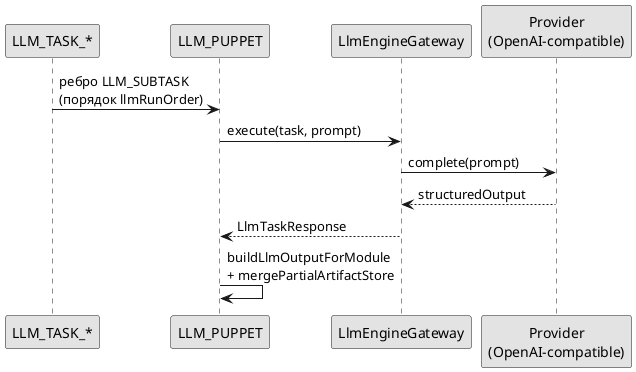

# Интеграция с LLM

[← К оглавлению](./README.md)

## Оглавление

1. Соответствие `ModuleId` → `LlmTask`  
2. Схема подзадача → `LLM_PUPPET` → артефакты  
3. Сборка prompt (`buildLlmBundlePrompt`)  
4. Ожидаемый JSON и пост-парс по задачам  
5. Устойчивость вызова  

## Модель задач

Внутренний enum [`LlmTask`](../../apps/web/lib/ai/llm-engine.ts): `"summary"` | `"checklist_analysis"` | `"psych_state"` | `"speaker_names"`.

Сопоставление подзадач графа → задача движка: [`LLM_TASK_CONTRACTS`](../../apps/web/lib/pipeline/llm-task-contracts.ts) и [`resolveLlmTaskForModule`](../../apps/web/lib/pipeline/modules/llm-engine.module.ts).

| `ModuleId` | `LlmTask` | Метка прогресса (`detail`) |
|------------|-----------|----------------------------|
| `LLM_TASK_SUMMARY` | `summary` | «обобщение» |
| `LLM_TASK_CHECKLIST` | `checklist_analysis` | «чек-лист» |
| `LLM_TASK_PSYCH` | `psych_state` | «разбор (LLM)» |
| `LLM_TASK_SPEAKER_NAMES` | `speaker_names` | «деанон» |

## Схема: подзадача → пульт → артефакты

```text
  LLM_TASK_SUMMARY ──ребро LLM_SUBTASK──┐
  LLM_TASK_SPEAKER_NAMES ────────────────┼──► LLM_PUPPET ──► LlmEngineGateway ──► Partial<ArtifactStore>
  LLM_TASK_PSYCH ────────────────────────┤         │
  LLM_TASK_CHECKLIST ────────────────────┘         │ (порядок: llmRunOrder на каждой подзадаче)
                                                   ▼
                                    merge в общий стор сессии
```



- [`LlmTaskSatelliteModule`](../../apps/web/lib/pipeline/modules/llm-task-satellite.module.ts) не вызывает сеть.
- [`LlmPuppetModule`](../../apps/web/lib/pipeline/modules/llm-puppet.module.ts) перечисляет подзадачи через [`listSubtasksForPuppet`](../../apps/web/lib/pipeline/llm-puppet-subtasks.ts), сортирует по [`readLlmRunOrder`](../../apps/web/lib/pipeline/llm-run-order.ts), для каждой вызывает [`LlmEngineGateway.execute`](../../apps/web/lib/ai/llm-engine.ts).

**Жёсткое правило:** URL, ключ, модель, таймауты, пресет контекста берутся с шага **`LLM_PUPPET`** ([`applyPuppetExecutionOverrides`](../../apps/web/lib/pipeline/modules/llm-puppet.module.ts)).

## Формирование prompt

Все четыре задачи используют один шаблон [`llmGatewayPrompts`](../../apps/web/lib/pipeline/modules/llm-engine.module.ts) → [`buildLlmBundlePrompt`](../../apps/web/lib/pipeline/llm-instructions-artifact.ts):

1. Текстовый блок инструкций из `LLM_INSTRUCTIONS.data.parts` (если есть), плюс строка-преамбула на английском («Follow the scenario instructions…»).
2. Разделитель `--- payload ---`.
3. JSON: `{ config, artifacts }`, где `artifacts` — стор **без** `LLM_INSTRUCTIONS` (чтобы не дублировать).

Дополнительно на этапе подготовки:

- [`mergeEmbeddedConfigIntoInstructionArtifact`](../../apps/web/lib/pipeline/modules/llm-engine.module.ts) вшивает в `LLM_INSTRUCTIONS` промпты из `step.config` подзадач (`instructionPrompt`, `speakerNamePrompt`, …).
- [`buildArtifactsForLlmGateway`](../../apps/web/lib/pipeline/modules/llm-engine.module.ts) собирает артефакты по входящим рёбрам подзадачи; добавляет fallback `READY_SPEAKERS` из полного стора; для `psych_state` может урезать `ENRICHED_TRANSCRIPT` под малый контекст.
- [`applySmallContextCompaction`](../../apps/web/lib/pipeline/modules/llm-puppet.module.ts) — ужимание по лимитам из `LlmBehaviorConfig`.

## Требования к JSON-ответу (по задачам)

Кратко; детальный пост-парс см. в [`buildLlmOutputForModule`](../../apps/web/lib/pipeline/modules/llm-engine.module.ts).

### summary (`LLM_TASK_SUMMARY`)

- Ожидается объект с `scenario`, `subScenario`, `sections[]`; опционально `quality` с `notes`, `doNotInfer[]`.
- Извлечение корня: [`extractJsonRootFromOutput`](../../apps/web/lib/pipeline/modules/llm-engine.module.ts), нормализация [`normalizeLlmSummary`](../../apps/web/lib/pipeline/modules/llm-engine.module.ts). Предупреждение при отбракованных секциях: `llm_summary_sections_rejected_invalid_contract`.

### speaker_names (`LLM_TASK_SPEAKER_NAMES`)

- Ожидаются `entries` / альтернативные ключи (`identities`, `speakers`, …).
- В продуктивные `entries` попадают только элементы с **непустыми** `speakerId`, `displayName`, `role` ([`buildSpeakerIdentityData`](../../apps/web/lib/pipeline/modules/llm-engine.module.ts)). Предупреждения: `speaker_identity_llm_passthrough`, `speaker_identity_map_rejected_invalid_contract`.

### psych_state (`LLM_TASK_PSYCH`)

- Промпт по умолчанию: [`defaultPsychInstructionPrompt`](../../apps/web/lib/pipeline/modules/llm-engine.module.ts) — строгий JSON, `labels` + `narrative` с `timelineEvents`, политика `assistive_non_diagnostic`, опциональная сверка лексикона при `enableLlmLexiconCheck`.
- Пост-разбор: [`parseStructuredPsychOutput`](../../apps/web/lib/pipeline/modules/llm-engine.module.ts) → `LLM_PSYCH_LABELS`, `LLM_PSYCH_NARRATIVE`.
- Новый режим: `segmentCommentMode="per_segment"` — дополнительно ожидается `narrative.segmentComments[]` (комментарий на каждый сегмент `READY_SPEAKERS`); при неполном/битом ответе LLM пропуски дозаполняются fallback-логикой.
- Метки без пары (labels + evidence) отбрасываются; нарратив без `timelineEvents` помечается `partial` и предупреждением `psych_narrative_partial_missing_timeline_events`.

### checklist_analysis (`LLM_TASK_CHECKLIST`)

- Массив результатов из ответа или fallback по `CHECKLIST_DEFINITION` ([`withChecklistFallback`](../../apps/web/lib/pipeline/modules/llm-engine.module.ts)).

## Валидация ответа провайдера

Провайдер возвращает `structuredOutput: Record<string, unknown>` ([`LlmProviderClient`](../../apps/web/lib/ai/llm-engine.ts)); дальше только программная нормализация, без JSON Schema в рантайме.

## Устойчивость вызова

[`executeWithResilience`](../../apps/web/lib/pipeline/modules/llm-puppet.module.ts): таймаут, ретраи, [`adaptConfigForAttempt`](../../apps/web/lib/pipeline/modules/llm-puppet.module.ts) при `llmAdaptiveDownshift`.
